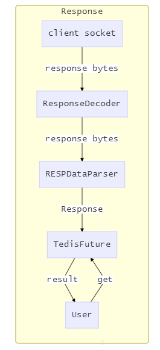

# Tedis 
```
 _____              _   _
|_   _|   ___    __| | (_)  ___
  | |    / _ \  / _` | | | / __|
  | |   |  __/ | (_| | | | \__ \
  |_|    \___|  \__,_| |_| |___/
```
Tedis is a redis client based on tcp & resp.

#### Features：

- [x] synchronous API
- [x] asynchronous API
- [x] connection pool
- [x] single node distributed lock
- [x] one node lock
- [x] bloom-filter
- [x] auto-retry
- [ ] red lock

#### Supported redis features:

- [x] pipeline
- [x] Lua script
- [ ] SSL
- [ ] Redis Cluster

## How to use
```java
Tedis tedis = new Tedis();
// traditional mode
TedisFuture<Result> f = tedis.set("a", "1");
Result r = f.sync();

// set mode to pipeline, Tedis.TRADITIONAL by default
tedis.setMode(Tedis.PIPELINE);
tedis.set("a", "1");
tedis.get("a");
TedisFuture<Results> f = tedis.submit();
// iterable
Results rs = f.sync();
for (Result r : rs) {
    // ...
}
```

## Structure




