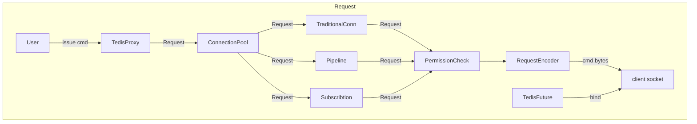
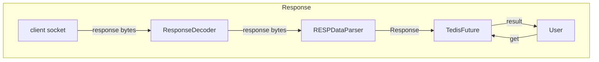

#### Request

```mermaid
graph TD   
   subgraph Request
   A[User] --issue cmd--> B[TedisProxy]
   F --Request--> X[TraditionalConn]
   F --Request--> Y[Pipeline]
   F --Request--> Z[Subscribtion] 
   B --Request--> F[ConnectionPool]
   X --Request--> H
   Y --Request--> H
   Z --Request--> H
   H[PermissionCheck] --> D
   D[RequestEncoder] --cmd bytes--> E[client socket]
   G[TedisFuture] --bind-->E
   end
   
   

  
   
   
```

#### Response

```mermaid
graph TD   
   subgraph Response
   G[client socket] --response bytes-->F[ResponseDecoder]
   F --response bytes--> H[RESPDataParser]
   H --Response--> I[TedisFuture]
   I --result--> J[User]
   J --get--> I
   end
```