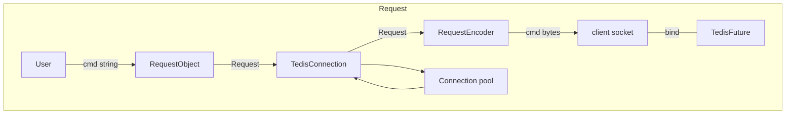
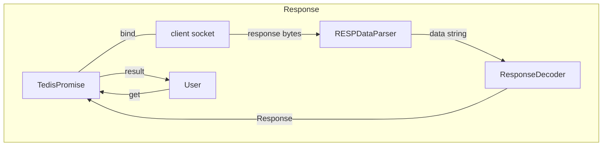

# Tedis doc

```
                             _____              _   _
                            |_   _|   ___    __| | (_)  ___
                              | |    / _ \  / _` | | | / __|
                              | |   |  __/ | (_| | | | \__ \
                              |_|    \___|  \__,_| |_| |___/
```

Tedis is a redis client based on tcp & resp.

#### Features：

- [x] synchronous API
- [x] asynchronous API
- [x] connection pool
- [x] single node distributed lock
- [ ] BloomFilter
- [ ]  auto-retry
- [ ] red lock

#### Supported redis features:

- [x] command with string
- [x] command with list
- [x] command with set
- [x] command with hash
- [x] command with zset

- [x] pipeline
- [ ] Lua script
- [ ] SSL
- [ ] Redis Cluster

### How to use


### Structure

#### Request



#### Response

