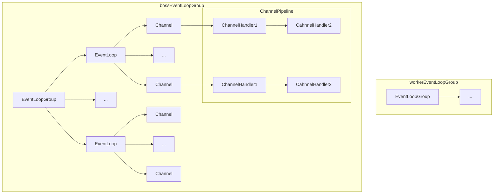

## 一、Netty架构

- 一个EventLoopGroup 包含一个或者多个EventLoop（一个或多个线程）；

- 一个EventLoop 在它的生命周期内只和一个Thread 绑定（ 串行处理绑定在其上多个的Channel），这里通过串行化减小了上下文切换的开销，但是同时可以调整EventLoopGroup的线程数来充分利用多核处理器通过并行提高效率

- 一个Channel 在它的生命周期内只注册于一个EventLoop，一个EventLoop 可能会被分配给一个或多个Channel。

- 一个Channel都有一个ChannelPipeline，ChannelPipeline中的Handler可以通过@Sharable注解标注，以供多个ChannelPipeline调用，但是线程不安全的Handler不可标注，比如说常用的消息解码器这种（因为会缓存socket数据，相当于是有线程状态的）

- **注意**：服务端通常处理一条连接有以下几个步骤：

  1. 从socket读取字节流

  2. 解码字节流得到java object

  3. 使用obj来执行业务逻辑

  4. 将响应的java obj编码成字节流
  5.  将字节流写入socket

  值得注意的地方在于第3步，通常我们将业务逻辑都是放在handler里面执行，但是上文提到，多个channel是串行执行的，所以如果业务逻辑很耗时的话，容易阻塞其他channel读写，这种情况下就考虑只把I/O（非阻塞IO）放在EventLoop线程执行，业务逻辑放到线程池处理。

### 1.1 Channel

生命周期：

### 1.2 ChannelHandlerContext 、 ChannelHandler 和 ChannelPipeline

* 三者关系

* 事件的流动方向

* ChannelHandlerContext   管理着ChannelHandler和ChannelPipeline之间的交互，它包含着与pipline和handler中一些功能一样的方法，只不过通过context调用时，数据会从当前handler开始流动，而在pipeline和handler上调用时，会在整个pipeline流动。

  

  

* 共享ChannelHandler

  使用@Sharable注解就可以让多个pipeline使用同一个handler，但是考虑到，多个channel的并发调用可能造成线程不安全的问题，所以不要共享的handler不应该存在修改状态的操作。

### 1.3 ByteBuf

* PooledByteBufAllocator

  底层由jemalloc实现

> 零拷贝
>
> 零拷贝（zero-copy）是一种目前只有在使用NIO 和Epoll 传输时才可使用的特性。它使你可以快速
> 高效地将数据从文件系统移动到网络接口，而不需要将其从内核空间复制到用户空间，其在像FTP 或者
> HTTP 这样的协议中可以显著地提升性能。但是，并不是所有的操作系统都支持这一特性。特别地，它对
> 于实现了数据加密或者压缩的文件系统是不可用的——只能传输文件的原始内容。反过来说，传输已被
> 加密的文件则不是问题。